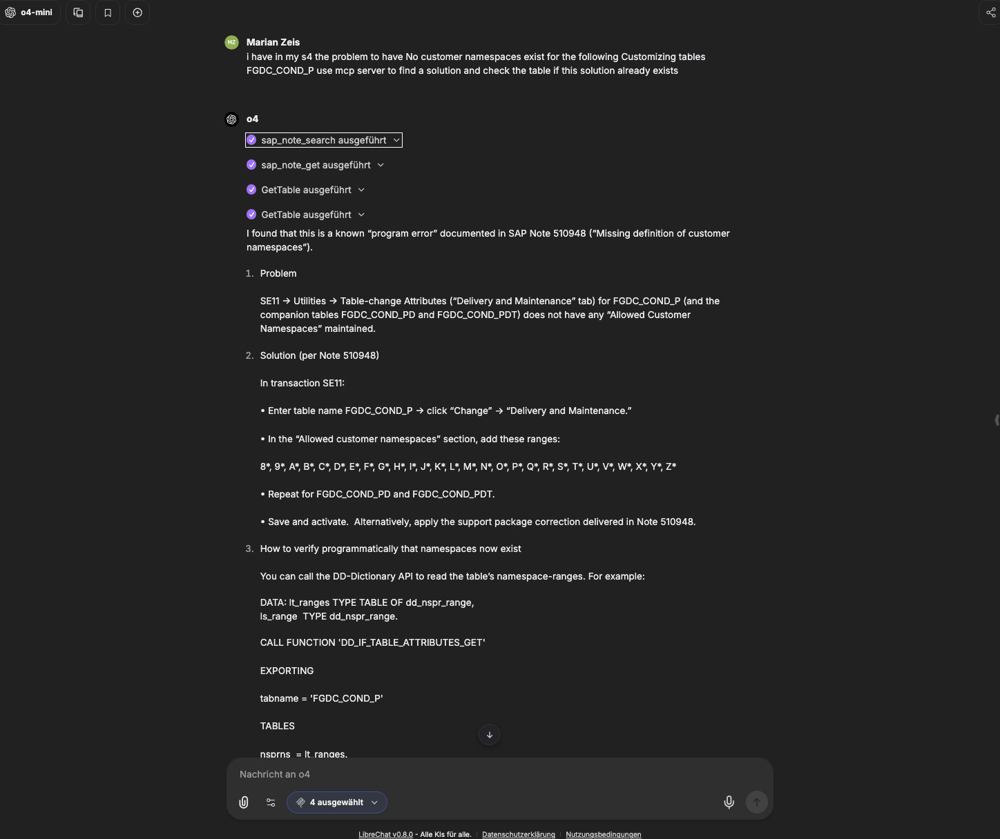
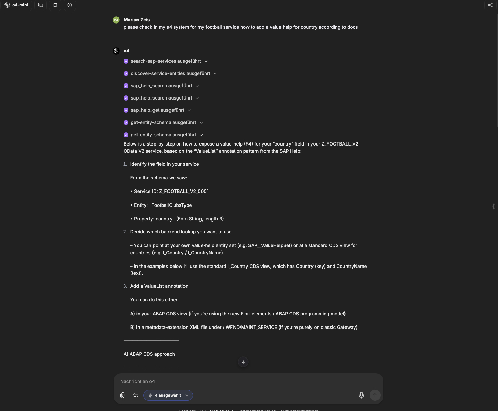
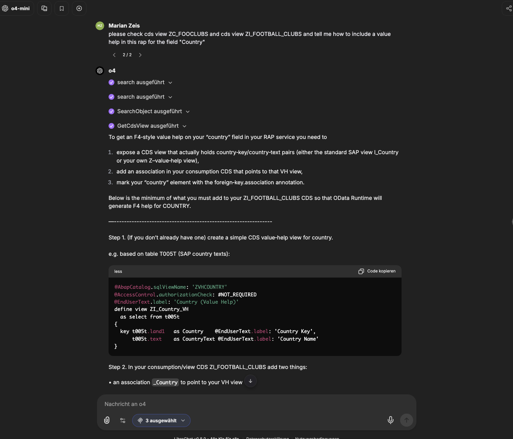

# SAP MCP Integration Use Cases - Real-World Consultant Scenarios

---

## 🛠️ Available MCP Servers & Capabilities

| Server | Purpose | What It Provides | Requirements |
|--------|---------|------------------|--------------|
| **SAP Docs MCP** | Documentation & Community search | SAPUI5/OpenUI5, CAP, ABAP docs, Help Portal, Community | None (always available) |
| **SAP Notes MCP** | Official Knowledge Base access | Error troubleshooting, patches, fixes | S-User certificate |
| **S/4HANA OData MCP** | Live S/4HANA system access | Service discovery, metadata, CRUD operations | SAP system credentials |
| **ABAP ADT MCP** | ABAP Development Tools integration | Source code, DDIC structures, development objects | SAP development system |

---

## 🎬 Real-World Use Case Scenarios

### Use Case 1: Error Resolution with System Verification

**Scenario:** Customer reports an error in their S/4HANA system. You need to:
1. Find the relevant SAP Note
2. Verify the fix applies to their system configuration  
3. Implement a safe corrective action

**Workflow:**

**Step-by-Step Process:**
1. **Search SAP Notes** using `sap_note_search` with error symptoms
2. **Fetch detailed Note** with `sap_note_get` for complete solution steps
3. **Verify DDIC structures** using ABAP ADT MCP to confirm table/field existence
4. **Cross-reference with live system** via S/4HANA OData to check current configuration
5. **Generate safe implementation plan** based on verified system state

**Key Benefits:**
- No manual copying of error codes or Note IDs
- Automatic verification against customer's actual system
- Confidence in solution applicability before implementation
- Audit trail of research and verification steps

---

### Use Case 2: OData Service Enhancement with Documentation Guidance

**Scenario:** Customer needs ValueList functionality added to their custom OData service. You need to:
1. Understand current service structure
2. Find official SAP documentation on ValueList implementation
3. Generate correct annotations and implementation steps

**Workflow:**

**Step-by-Step Process:**
1. **Discover services** using `search-sap-services` to find the target service
2. **Inspect entity metadata** with `discover-service-entities` and `get-entity-schema`
3. **Search SAP documentation** using `sap_help_search` for ValueList patterns
4. **Retrieve detailed guidance** with `sap_help_get` for implementation examples
5. **Generate specific annotations** tailored to the discovered entity structure

**Key Benefits:**
- Live system metadata drives documentation search
- Precise implementation guidance for specific entity structures
- Reduced research time and implementation errors
- Validated patterns from official SAP documentation

---

### Use Case 3: CDS View Development with Best Practices

**Scenario:** Developing custom CDS views with proper Value Help annotations. You need to:
1. Research current ABAP/CDS annotation patterns
2. Compare with existing system implementations
3. Generate compliant, efficient code

**Workflow:**

**Step-by-Step Process:**
1. **Search CDS documentation** using SAP Docs MCP for `Common.ValueList` patterns
2. **Retrieve canonical examples** with detailed annotation syntax
3. **Analyze existing CDS definitions** via ABAP ADT MCP using `GetStructure`/`GetInclude`
4. **Compare current vs. recommended implementations**
5. **Generate minimal, compliant enhancement plan**

**Key Benefits:**
- Access to both official patterns and existing customer code
- No manual copy-paste of sensitive CDS definitions
- Validation against SAP best practices and customer standards
- Efficient delta analysis for enhancement planning

---
